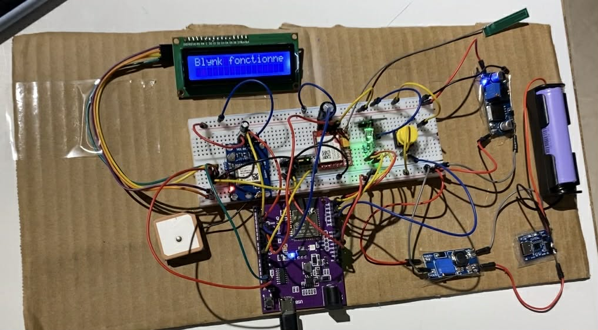
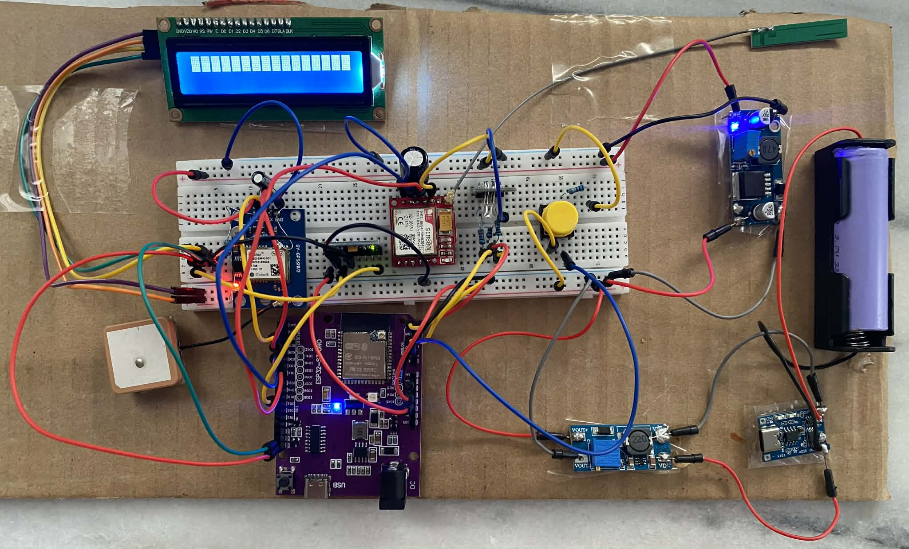

# Smart Belt for Alzheimer Fall Detection (ESP32-S3)

A wearable safety belt that detects falls and urgent events for elderly people with Alzheimer. The device classifies motion in real time, shows status on an RGB LED and 16x2 I2C LCD, and sends alerts with a Google Maps link through Blynk.

## What it does
- Real-time fall detection from MPU6050 accelerometer + gyroscope data.
- Emergency push button for manual alerts.
- WiFi-based geolocation (Google Geolocation API) with fallback coordinates.
- Blynk dashboard + email event notifications.
- On-device visual feedback (RGB LED + LCD).

## Photos

## How it works (high level)
1. MPU6050 streams accel/gyro data.
2. The firmware runs a lightweight ML/heuristic classifier every 100 ms.
3. State changes drive the RGB LED and LCD.
4. On fall or button press, the device resolves location and sends a Blynk event with a Google Maps link.

## Repository layout
- `esp32S3_code/Smart_belt.ino` - main firmware (ESP32-S3).
- `esp32S3_code/fall_detection_model.h` - optimized on-device classifier used by the firmware.
- `esp32S3_code/scaler_config.h` - scaler parameters (included but not used in the current firmware).
- `esp32S3_code/secrets.h.example` - credentials template (copy to `secrets.h`).
- `RandomForestModel/trainandconverter.py` - training pipeline and C export script.
- `RandomForestModel/fall_detection_model.h` - full Random Forest model generated by emlearn.
- `RandomForestModel/scaler_config.h` - scaler generated for the RF features.
- `RandomForestModel/dataset_merged.parquet` and `part_*_numeric.xlsx` - prepared dataset files.
- `Hardware/Requirements.txt` - hardware parts list.
- `Hardware/Prototype.jpg`, `Hardware/prototype1.jpg` - prototype photos.
- `.gitignore` - ignores local secrets and common artifacts.

## Hardware requirements
From `Hardware/Requirements.txt`:
- ESP32-S3 WROOM-1-N16R8
- MPU6050 GY-521 (accelerometer + gyro)
- 16x2 I2C LCD display
- Push button
- RGB LED (red/green/blue)
- GPS module GY-NEO6MV2 (not used by current firmware)
- SIM800L GSM/GPRS module (not used by current firmware)
- 18650 Li-ion battery + DC-DC converters (MT3608 boost, LM2596S buck)
- Breadboard and wiring

Note: the current firmware uses Google Geolocation over WiFi. The GPS and GSM modules are listed in the hardware list but are not referenced in the code yet.

## Pin mapping (ESP32-S3)
- MPU6050: SDA = 8, SCL = 9, INT = 10
- RGB LED: Red = 4, Green = 5, Blue = 6
- Emergency button: 7 (INPUT_PULLUP)

## Firmware setup
1. Open `esp32S3_code/Smart_belt.ino` in Arduino IDE.
2. Install required libraries:
   - Blynk
   - ArduinoJson
   - Adafruit_MPU6050
   - Adafruit Sensor
   - LiquidCrystal_I2C
3. Copy `esp32S3_code/secrets.h.example` to `esp32S3_code/secrets.h` and fill:
   - `WIFI_SSID`, `WIFI_PASS`
   - `BLYNK_TEMPLATE_ID`, `BLYNK_TEMPLATE_NAME`, `BLYNK_AUTH_TOKEN`
   - `GOOGLE_API_KEY`
   If `secrets.h` is missing, the firmware falls back to placeholders and will not connect.
4. (Optional) Change LCD I2C address in `LiquidCrystal_I2C lcd(0x27, 16, 2)` if needed.
5. Select your ESP32-S3 board, then build and upload.

Serial runs at 115200. The device performs a WiFi geolocation test during boot, then enters the main loop.

## Blynk configuration
The firmware uses these virtual pins:
- `V0`: request location (button)
- `V1`: display Google Maps link
- `V2`: random state test
- `V3`: current state (`IDLE`, `WALKING`, `FALLING`)
- `V4`: user name
- `V5`: user age
- `V7`: user email
- `V8`: user phone
- `V9`: test email (triggers the same alert flow as the button)

Create a Blynk event named `button_alert` for notifications. Both fall alerts and button alerts use this event with different message text.

## Troubleshooting
- LCD blank or garbled: verify the I2C address (0x27 vs 0x3F) and wiring.
- No Blynk connection: confirm WiFi credentials and `BLYNK_AUTH_TOKEN` in `secrets.h`.
- GPS link always shows fallback: check Google API key and that WiFi scanning is permitted.

## ML model and training
- Dataset: SisFall (from Kaggle). See `RandomForestModel/Read_Me.txt`.
- Training script: `RandomForestModel/trainandconverter.py`.
  - Builds features: ax, ay, az, gx, gy, gz, age, acc_mag, gyro_mag, acc_ratio.
  - Trains a Random Forest and exports `fall_detection_model.h` using emlearn.
  - Writes `scaler_config.h` with StandardScaler parameters.
  - Uses `dataset_merged.parquet` by default; override with `DATA_PATH` and `OUTPUT_DIR`.

The current firmware does **not** use the full Random Forest model; it uses `esp32S3_code/fall_detection_model.h` which implements an optimized sensor-fusion classifier with temporal smoothing. If you want to deploy the full RF model, you will need to swap the header and update the inference path.

## Safety and privacy notes
- This is a prototype, not a certified medical device.
- Google Geolocation uses nearby WiFi access points; ensure you comply with privacy policies and obtain consent.
- Alerts are throttled (30s cooldown) to reduce spam.

## Security notes
Secrets are loaded from `esp32S3_code/secrets.h` (gitignored). If you previously committed real credentials, rotate them and purge from history before sharing the repo.

## License
No license file is present. If you plan to distribute or reuse this project, add a license file and update this section.

## Acknowledgements
- SisFall dataset (Kaggle)
- Blynk and the Arduino ecosystem
