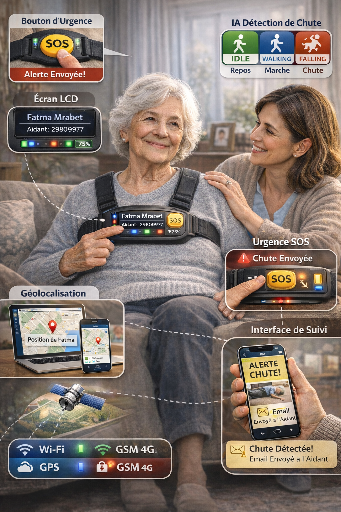

#  Trackify
### Smart Monitoring & Safety Device for Alzheimer Patients

> "Localisé partout, protégé en permanence"

---

##  Product Preview

###  Concept Design (Imagined Product)

###  Real Prototype

---

## Table of Contents

- [Overview](#-overview)
- [Problem](#-problem)
- [Solution](#-solution)
- [Features](#-features)
- [System Architecture](#-system-architecture)
- [Hardware](#-hardware)
- [AI Model](#-ai-model)
- [User Interfaces](#-user-interfaces)
- [Cost & Positioning](#-cost--positioning)
- [Future Improvements](#-future-improvements)
- [Contributors](#-contributors)

---

##  Overview

**Trackify** is an intelligent wearable device designed to ensure the **safety, tracking, and assistance of Alzheimer patients**.

It combines IoT, Artificial Intelligence, and real-time communication to:
- Monitor patient activity
- Detect dangerous situations
- Alert caregivers instantly

The system is designed specifically for **real-world constraints in Tunisia**, focusing on affordability, simplicity, and reliability.

---

## Problem

Alzheimer patients often face:

- 🧭 Disorientation and getting lost  
- ⚠️ High risk of falls  
- 🚫 Inability to call for help  

In Tunisia, existing solutions are:
- Expensive
- Not locally adapted
- Technically complex

This creates a **serious safety gap** for patients and stress for families.

---

##  Solution

Trackify provides a **complete, intelligent, and accessible system**:

- 📍 Continuous localization  
- 🧠 AI-based fall detection  
- 🚨 Automatic alerts  
- 🆘 Emergency SOS button  
- 📱 Real-time monitoring interface  

---

## Features

### Intelligent Fall Detection
- Motion analysis using MPU6050
- AI model (Random Forest)
- Classifies:
  - Idle
  - Walking
  - Falling

---

### Smart Geolocation
- GPS module (outdoor)
- WiFi-based positioning (indoor)
- Automatic switching between modes

---

### Emergency System
- Manual SOS button
- Automatic alert on fall detection
- Notifications via:
  - Email
  - SMS (GSM module)

---

###  Real-Time Monitoring
- Web dashboard (Blynk)
- Mobile application
- Live tracking + alerts

---

###  Visual Feedback
- LCD screen (patient info & system status)
- RGB LED:
  - 🟢 Idle
  - 🔵 Walking
  - 🔴 Falling

---

##  System Architecture

Trackify uses a **hybrid communication system**:

- WiFi → real-time cloud communication  
-  GSM → fallback (SMS alerts)  
-  GPS → outdoor tracking  
-  API (WiFi positioning) → indoor tracking  

This ensures **continuous operation in all environments**.

---

## Hardware

| Component | Role |
|----------|------|
| ESP32-S3 | Main controller |
| MPU6050 | Motion detection |
| GPS NEO-6M | Location tracking |
| SIM800L | GSM communication |
| LCD 16x2 | Display |
| RGB LED | Status indication |
| SOS Button | Emergency trigger |
| Battery 18650 | Power supply |

---

##  AI Model

- Model: **Random Forest**
- Dataset: **SisFall**
- Runs directly on ESP32
- Real-time classification of patient state

---

##  User Interfaces

###  Web Dashboard
- Real-time monitoring
- Device configuration
- Data visualization

### Mobile App
- Notifications
- Alerts
- Patient tracking

---

##  Cost & Positioning

| Item | Value |
|------|------|
| Production Cost | ~178 TND |
| Final Price | ~210 TND |

💡 Compared to international solutions (800–2400 TND), Trackify is:
- More affordable
- Locally adapted
- Feature-complete

---

## Future Improvements

- Miniaturized wearable design
- Improved mobile application
- Battery optimization
- Advanced AI models
- Custom enclosure (industrial design)

---

## Contributors

| Name | Email |
|------|------|
| Nour Nejia Slim | nournejia.slim@insat.ucar.tn |
| Yassine Chouk   | yassine.chouk@insat.ucar.tn |
| Sonia Mejri |sonia.mejri@insat.ucar.tn |
| Zaineb Kchaou |  zaineb.kchaou@insat.ucar.tn |

##  Impact

Trackify is more than a device — it is a **human-centered solution** that:

- Protects vulnerable individuals  
- Reduces anxiety for families  
- Enables safer independent living  

---
